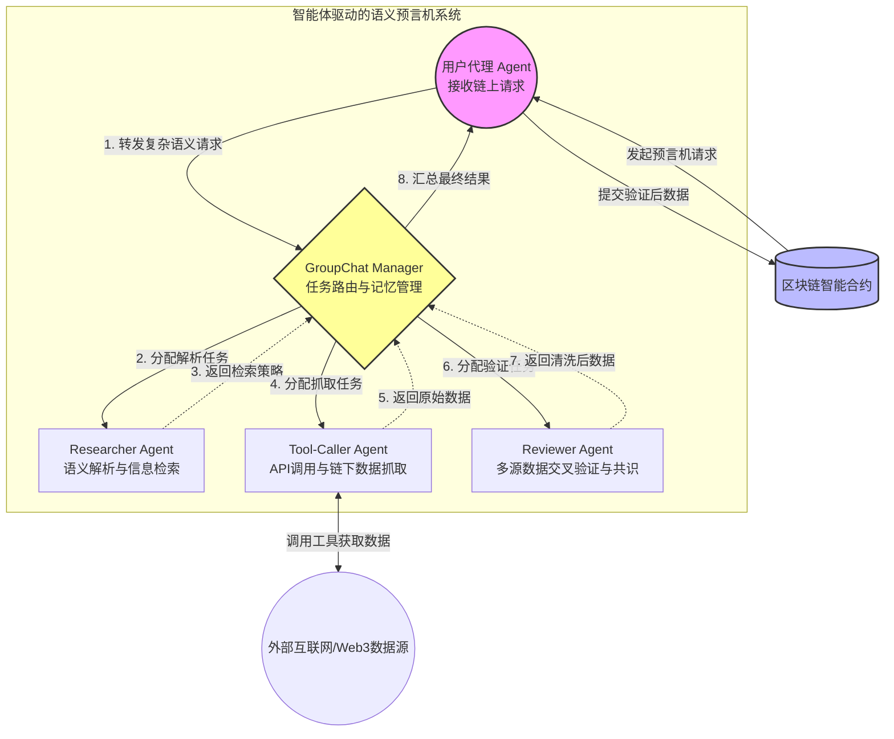

```mermaid
graph TD
    subgraph 智能体驱动的语义预言机系统
        UserProxy((用户代理 Agent<br>接收链上请求))
        Manager{GroupChat Manager<br>任务路由与记忆管理}
        
        Agent1[Researcher Agent<br>语义解析与信息检索]
        Agent2[Tool-Caller Agent<br>API调用与链下数据抓取]
        Agent3[Reviewer Agent<br>多源数据交叉验证与共识]
        
        UserProxy -->|1. 转发复杂语义请求| Manager
        Manager -->|2. 分配解析任务| Agent1
        Agent1 -.->|3. 返回检索策略| Manager
        Manager -->|4. 分配抓取任务| Agent2
        Agent2 -.->|5. 返回原始数据| Manager
        Manager -->|6. 分配验证任务| Agent3
        Agent3 -.->|7. 返回清洗后数据| Manager
        Manager -->|8. 汇总最终结果| UserProxy
    end

    Blockchain[(区块链智能合约)]
    ExternalAPI((外部互联网/Web3数据源))

    Blockchain -->|发起预言机请求| UserProxy
    UserProxy -->|提交验证后数据| Blockchain
    Agent2 <-->|调用工具获取数据| ExternalAPI

    style UserProxy fill:#f9f,stroke:#333,stroke-width:2px
    style Manager fill:#ff9,stroke:#333,stroke-width:2px
    style Blockchain fill:#bbf,stroke:#333,stroke-width:2px
```